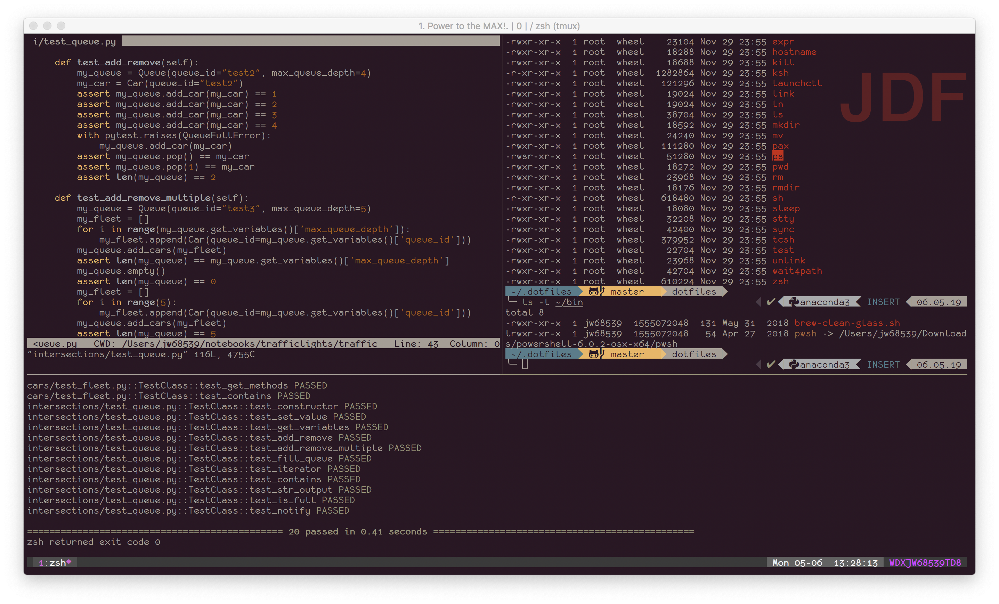

# ***NOTE***
__At the time of this commit, these instructions are incomplete and I haven't worked all the bugs out of the configurations. Until this notice is removed, proceed with caution.__



# Introduction
I started down this path to synchronize my standard dotfiles across my UNIX-like computers, which are macOS and raspbian based. I've spent quite a bit of time tuning these to my liking, and they reflect my particular set of interests (i.e. I do much of my programming in Python and not much in other languages, so my vim configurations reflect this).

For a list of the plugins installed and/or used by these dotfiles, you can [find them here](whats_included.md).


## Documentation
Besides the documentation for each module/plugin I've used and for ZSH itself, I've been [compiling a cheatsheet of Vim commands/key mappings](vim-cheatsheet.md) for the various Vim plugins.

## Prerequisites
Obviously, this repo depends on using [git](https://git-scm.com/), so make sure you have a current release installed.

This set of configurations are predicated on [zsh](https://www.zsh.org/) and [vim](https://www.vim.org/), and to a lesser extent [iTerm2](https://iterm2.com/) (which is only available on macOS). Naturally, those need to be installed for this repo to be of much use. Some of the plugins use [Python](https://www.python.org/), so a current version of that is also needed. As with git, most modern operating systems include versions of zsh, vim, and python, upgrading to the most recent stable version of each is recommended.

Of special note, the YouCompleteMe vim plugin does not like virtual environment versions of Python (e.g. anaconda, pyenv). On a Mac, the best bet for getting a current version is to install python2 and python3 via homebrew.

Some of the prompt modifications from oh-my-zsh and powerline9k rely on special glyph characters from either the [nerd fonts](https://nerdfonts.com/) or [powerline fonts](https://github.com/powerline/fonts) collections. These should be installed on your workstations if you intend to use this functionality in your prompts. My configurations do use some, particularly triangle separators between segments and git repo segments.

If you have run through all or part of this process and backed everything off, you'll likely need to unset the ZSH environment variable by typing ```unset ZSH```

The YouCompleteMe core library build depends on [cmake](https://cmake.org/). If it's not installed already, use your operating system's package manager (e.g. [yum](http://yum.baseurl.org/) or [apt-get](https://wiki.debian.org/Apt) on most Linuxes, [homebrew](https://brew.sh/) on macOS, etc.)

The terminal multiplexer [tmux](https://github.com/tmux/tmux/wiki) is an integral part of this config. It also needs to be installed prior to this process.

While not directly tied to the dotfiles in this repo, I've found [autojump](https://github.com/wting/autojump) to be a very useful addition to my shell toolbox.

## Clone this repo
To clone the repo into the standard location:

```
git clone https://github.com/hubrigant/dotfiles ~/.dotfiles
```

## Automated install
I've included an installer script that puts everything in place. While it has been working fine on my systems, it hasn't been tested anywhere except on a Mac running Mojave and a Raspberry Pi running raspbian stretch, so proceed with caution. Even though the installer will do its best to make a backup for you, it might be a good idea to backup any of the dotfiles you already have first.

### Exceute the install script
To use the automatic installer, type the following:

```
~/.dotfiles/scripts/install_dotfiles.sh
```


## Manual install
If you don't want to, or can't, use the install script, the following are the steps to perform the installation manually.

### Install autosuggestions plugin
The [autosuggestions plugin](https://github.com/zsh-users/zsh-autosuggestions) is the only oh-my-zsh plugin I use that can't be installed yet via zgen, so you'll have to do this manually.

### Create links to managed dotfiles
```
rm ~/.aliases
rm ~/.bundles.vim
rm ~/.gitconfig
rm ~/.gitignore_global
rm ~/.tmux.conf
rm ~/.vimrc
rm ~/.zgen.conf
rm ~/.zshrc

ln ~/.dotfiles/dots/common/aliases                  ~/.aliases
ln ~/.dotfiles/dots/common/bundles.vim              ~/.bundles.vim
ln ~/.dotfiles/dots/common/gitconfig                ~/.gitconfig
ln ~/.dotfiles/dots/common/gitignore_global         ~/.gitignore_global
ln ~/.dotfiles/dots/common/tmux.conf                ~/.tmux.conf
ln ~/.dotfiles/dots/common/vimrc                    ~/.vimrc
ln ~/.dotfiles/dots/common/zgen                     ~/.zgen.conf
ln ~/.dotfiles/dots/common/zshrc                    ~/.zshrc
```

### Get zgen
[zgen](https://github.com/tarjoilija/zgen) is a plugin manager for zsh. Most of the zsh-level plugins are installed and managed by zgen, so it needs to be in place first:

```
git clone https://github.com/tarjoilija/zgen.git "${HOME}/.zgen"
```

and then activate the new configuration by typing ```source ~/.zshrc```. This should trigger zgen to pull down the plugins listed in the zshrc file.

### Get vim plugins
The [Vundle vim plugin manager] should be installed by zgen. Once it's available, tell Vundle to install the vim plugins by entering the command ```vim +PluginInstall +qall```

### Build the YCM library
One of the vim plugins, YouCompleteMe, needs to have its core libraries built. To do this, use the following commands:

```
cd ~/.vim/bundle/Vundle.vim/YouCompleteMe
./install.py
```

## Local machine-specific configurations
If you have configurations that are specific to a particular machine, such as OS-dependent things, they can be stored in the file ```.machinerc``` that is not tracked as part of this repo. Naturally, this file should be listed in your .gitignore.
