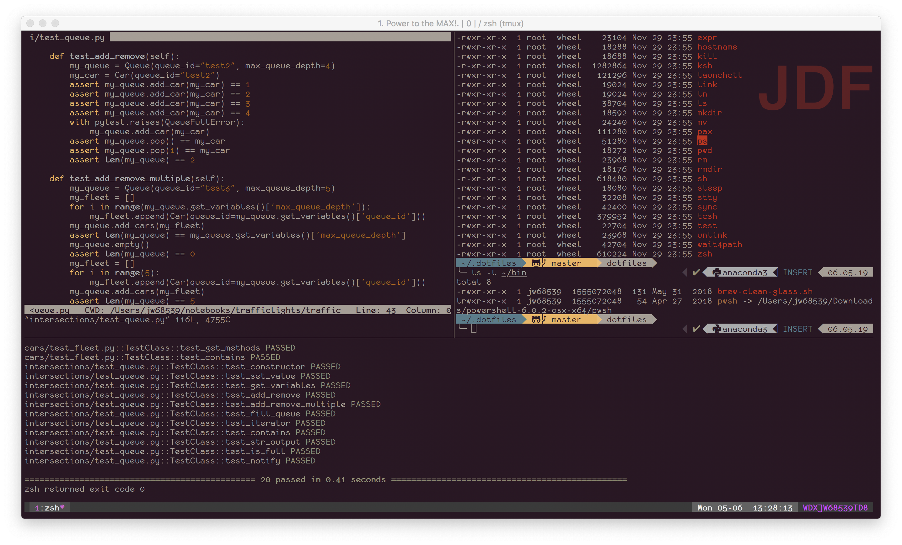

# ***NOTE***
__At the time of this commit, these instructions are incomplete and I haven't worked all the bugs out of the configurations. Until this notice is removed, proceed with caution.__

# Introduction
I started down this path to synchronize my standard dotfiles across my UNIX-like computers, which are macOS and raspbian based. I've spent quite a bit of time tuning these to my liking, and they reflect my particular set of interests (i.e. I do much of my programming in Python and not much in other languages, so my vim configurations reflect this).

For a list of the plugins installed and/or used by these dotfiles, you can [find them here](whats_included.md).

# Goals
While I initially started with the intent to get some of the nice command prompt goodies from oh-my-zsh and the powerlevel9k theme, I've been expanding my customiztions over time. At this point, I am trying to:

* Use iTerm2, tmux, and various plugins to do code editing in Vim
* Reduce stress on my wrists by minimizing the number of times I have to move my hands from normal typing position
* Reduce the number of keystrokes it takes me to do things in the shell
* Extend the wrist benefits I've gained in the terminal to browsing in Firefox
* Synchronize my standard configs and plugins across the various UNIX-based systems I use
* Keep an off-site backup of my configs

## Documentation
Besides the documentation for each module/plugin I've used and for ZSH itself, which can be found in the repositories for the respective software and thus I won't duplicate here, I've been [compiling a cheatsheet of Vim commands/key mappings](vim-cheatsheet.md) for the various Vim plugins. There is also [a file listing significant customizations](customizations.md) that I've done to tailor the system to my personal style/needs.
